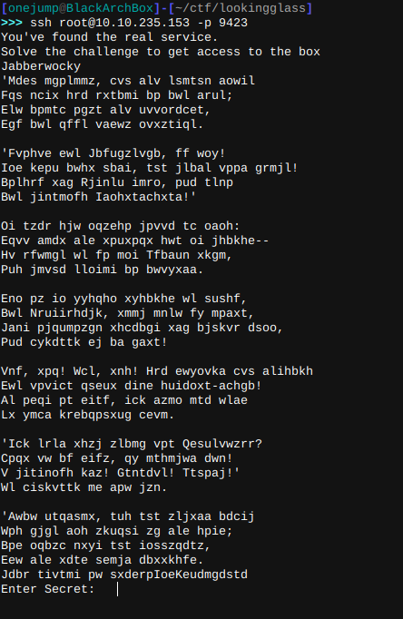

# Enumeration

## Rustscan results

    Open 10.10.235.153:22
    Open 10.10.235.153:9005
    Open 10.10.235.153:9003
    Open 10.10.235.153:9000
    Open 10.10.235.153:9006
    Open 10.10.235.153:9009
    .......
    Open 10.10.235.153:13000

This machine presented 4000+ open ports which would be imposible to enumerate with nmap in a reasonable time frame. I went to check the ports with nc and discovered the following.

    >>>>nc 10.10.235.153 9005
    SSH-2.0-dropbear 

All the ports above 9000 appear to be running SSH-2.0-dropbear, and when attempting to connect to these ports we receive the following.

Depending on which port you try to connect it tells you either "Lower" or "Higher", (funny thing is that these are in inverted order), my assumption was that this would eventually point to the correct port so I made the following python script to try and find the correct port.

    import subprocess

    port = 9000
    a =0
    while a != 1:
        output = subprocess.check_output(f"ssh -o StrictHostKeyChecking=no root@10.10.235.153 -p {port}", shell=True)
        print(output)
        if "Lower" in str(output):
            port += 50
            print(f"Port: {port} wrong, We need to go higher!")
        elif "Higher" in str(output):
            port -= 1
            print(f"Port: {port} wrong, We need to go lower")
        else:
            print("Found it, the port is: ", port)
            a = 1

Here is the output.

It ended up crashing when it got to the correct port but hey, if it works it works.

## Getting Access

When trying to connect to that port we get the following, it appears to be an encrypted text and at the end it asks for a secret.

After a bit of digging this appears to be the [Jabberwocky Poem](https://www.poetryfoundation.org/poems/42916/jabberwocky) but encrypted, I looks like Caesar cipher but that wasn't it, I took a guess at Vigenere cipher since you can use a piece of the plaintext and a piece of the ciphertext to get the key.

With this we get the Vigenere encryption key. And decrypting the poem we get this.

Now we can input the secret and we get the following.

We get the credentials for the "jabberwock" user. 

Then we can log in via ssh in port 22 with these credentials and in our home directory we find "user.txt", (notice that this is reversed, so you have to reverse it back).

## Privilege escalation

Roaming around in the machine I could see there are many users and that we can run /sbin/reboot as root.

I started doing some manual enumeration and found this in the /etc/crontab file.

At reboot the user tweedledum runs the script "twasBrillig.sh" that its own by jabberwock, wich means we can edit it and add a reverse shell.

Set up the listener and then reboot the machine and we get a shell as tweedledum. 

In tweedledum's home directory we see 2 files, looking at humptydumpty.txt we find this.

After decoding it we find its humptydumpty's password.

We log in to the humptydumpty user and find the file poetry.txt. Sadly that file didnt appear to contain any relevant information.

Roaming around looking for ways to escalate privileges I found that we could read alice file in /etc/sudoers.d and that getting to the alice user is pretty much getting to root.

At this point I decided to run linpeas.sh since I ran out of ideas. But didnt find anything.

After a while I noticed that we have execute permissions on alice's home directory. Wich means we can access her files.

But since we dont have read permission we cat list the directory, so I decided to try and cat a well known file, and bingo.

I copied the key to my machine, and connected with ssh into the alice user.

In the home directory we see the file kitten.txt, I'm not sure if its completely irrelevant but since we saw earlier that alice can just run /bin/bash as root I'll just do that.

And like that, we are root, we can find roo.txt(reversed) in /root and with that we finish this box. 